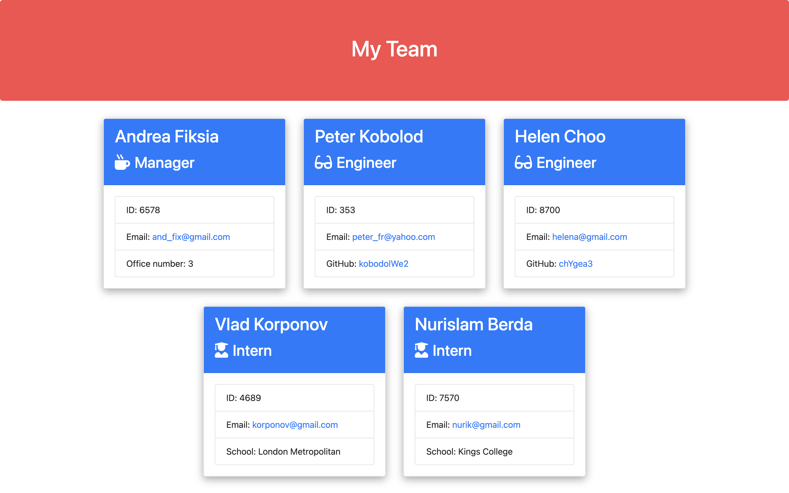

# OOP_team_profile_generator
Node.js command-line application that generates a webpage and displays employee's basic info

## Usage
This application will take in information about employees on a software engineering team, then generates an HTML webpage that displays summaries for each person. 

***User Story ***  
As a manager a user want to generate a webpage that displays my team's basic info so that a user have quick access to their emails and GitHub profiles.

---------------------------
The following  image shows the web application's appearance

### Tools used:
* Jest
* Inquirer
* Bootstrap